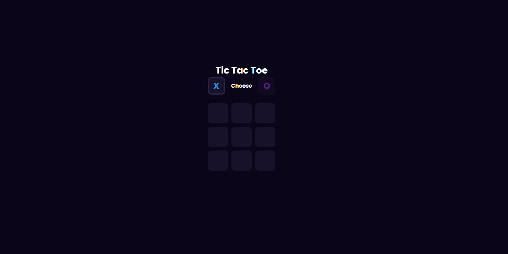
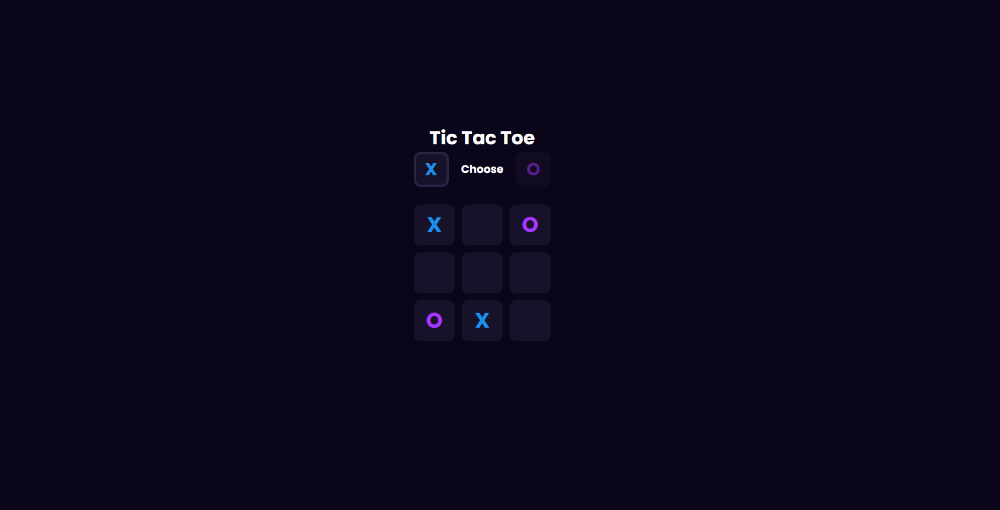
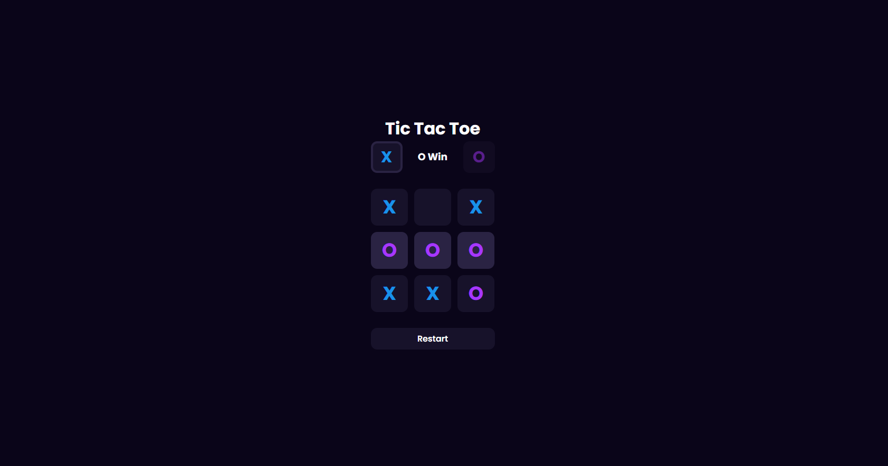

<h1>Tic Tac Toe 🎮</h1>
A classic Tic Tac Toe game built using React, Node.js, and Firebase. Play against a friend and enjoy a smooth, interactive experience!

<h2>Features</h2>
✔️ Two-player mode
✔️ Simple and intuitive UI
✔️ Real-time updates with Firebase

<h2>Installation</h2>
Clone the repository:
bash
Copy
Edit
git clone https://github.com/GrandDadDan/daniel-marais.git
cd daniel-marais
 
Install dependencies:
bash
Copy
Edit
npm install
Run the app:
bash
Copy
Edit
npm start
Enjoy the game! 🚀

<h1>Screenshot Examples 📸</h1>
 

  

